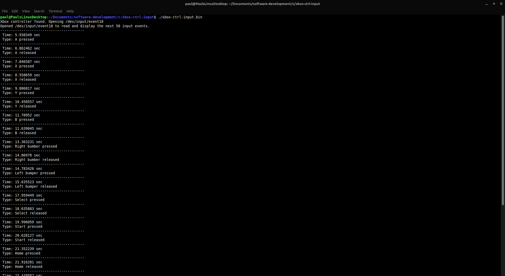

#xbox-ctrl-input
## Purpose
I made this to better understand how input devices work on Linux systems and how user space applications can use input devices.

## Overview
This program uses the linux input subsystem to detect a connected Xbox controller and read and display input events from it. The program first reads from `/proc/bus/input/devices` to determine if a device with a product number of 0x02ea (product number of a Microsoft Xbox controller) exists. Once a controller is found, its device file can be opened and read from. Data read from a `/dev/input/eventXX` file (XX is some number) is of the type `struct input_event` and its members can be accessed by user programs.

The [Linux Input Subsystem User Space API](https://www.kernel.org/doc/html/v5.4/input/input.html) was very helpful in making this program. 

## Building
Run `make` in the project directory to build from the `makefile`.

## Running
From the project directory, execute `./xbox-ctrl-input.bin` in the command line. Optionally, the number of input events you'd like to print can be provided as an argument. By default, the program will print 50 events and then exit.

## Result

